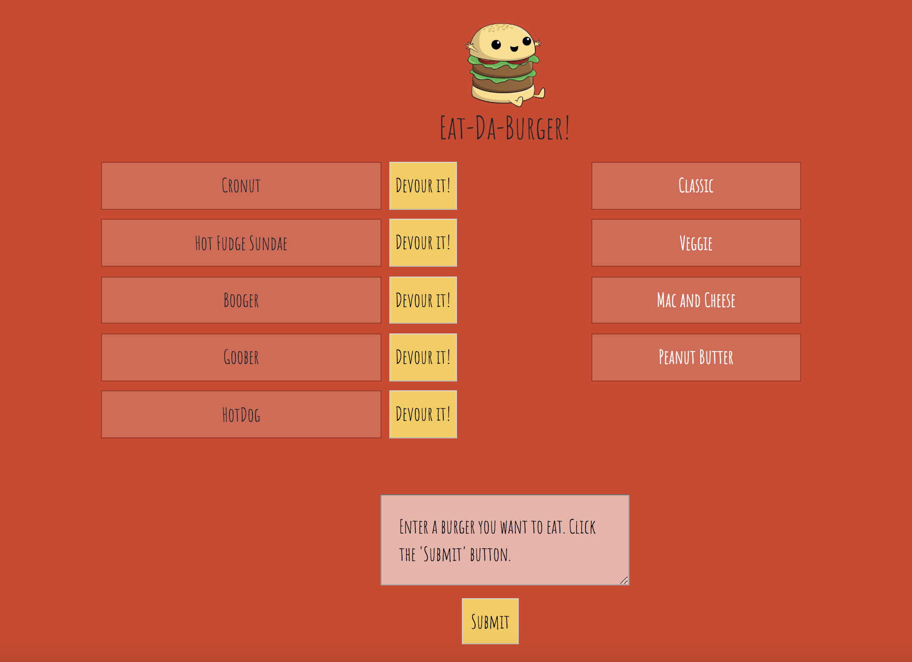

# Eat-Da-Burger

## Summary
Eat-Da-Burger is a restaurant app that lets users input the names of burgers they would like to eat.

Please check out the deployed version through Heroku: [Eat-Da-Burger](https://polar-chamber-56090.herokuapp.com/).

## Languages Used
This burger logger is created with MySQL, Node, Express, Handlebars and a homemade ORM (yum!).

## Introduction
Whenever a user submits a burger's name, your app will display the burger on the left side of the page -- waiting to be devoured.

## Devour It!
Each burger in the waiting area also has a Devour it! button. When the user clicks it, the burger will move to the right side of the page.
